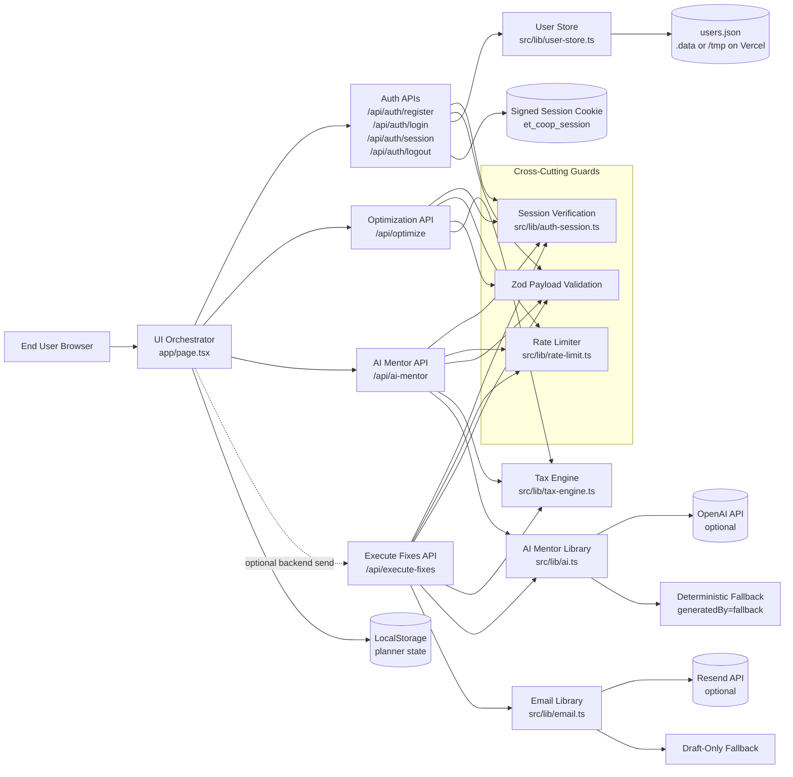

# ET Co-Op Architecture Document

## 1) System Overview

ET Co-Op is a Next.js 16 App Router application for household tax planning with three core service capabilities:

1. Deterministic optimization engine (tax leakage, regime comparison, planning insights).
2. AI mentor generation with safe fallback mode.
3. HR action completion flow (judge mode mocked toast in UI, backend execute-fixes available for provider-enabled environments).

The architecture is request-response (synchronous) and API-first:

- UI orchestration and user interactions are in `app/page.tsx`.
- API routes in `app/api/**` validate, authorize, and orchestrate domain logic.
- Business libraries in `src/lib/**` encapsulate optimization, AI, email, auth, rate-limits, and user storage.

---

## 2) Architecture Diagram

---

## 3) Agent Roles and Responsibilities

| Agent/Service Role | Primary Responsibility | Implementation |
|---|---|---|
| UI Orchestrator | Collects inputs, invokes APIs, renders decision board, and handles judge-focused toasts/demo bypass UX | `app/page.tsx` |
| Session/Auth Agent | Creates/verifies HMAC-signed session cookies and provides auth guard helpers | `src/lib/auth-session.ts` |
| Identity Persistence Agent | Registers users, verifies credentials, hashes passwords with per-user salt, stores users in writable JSON store | `src/lib/user-store.ts` |
| Optimization Agent | Performs deterministic tax optimization and advanced planning modules | `src/lib/tax-engine.ts` |
| AI Mentor Agent | Produces plain-language mentor output and HR drafts using OpenAI when available, fallback otherwise | `src/lib/ai.ts` |
| Execution Agent | Sends HR drafts via Resend if configured, otherwise returns draft-only result | `src/lib/email.ts` |
| Guardrail Agent | Enforces request schema validation and endpoint-level rate limiting | `app/api/*/route.ts`, `src/lib/rate-limit.ts` |

---

## 4) Communication Model

### A) Authentication flow

1. UI sends register/login request.
2. Auth route validates payload via Zod.
3. User store validates and persists credentials.
4. Route appends signed cookie (`et_coop_session`) and returns authenticated response.
5. UI calls `/api/auth/session` on load to rehydrate user session.

### B) Optimization flow

1. UI posts optimization payload to `/api/optimize`.
2. Route enforces auth + rate limits + schema validation.
3. Route calls deterministic engine (`runHouseholdOptimization`).
4. JSON result is returned with rate-limit headers.

### C) AI Mentor flow

1. UI posts optimization request to `/api/ai-mentor`.
2. Route recomputes optimization result for consistency.
3. AI library attempts OpenAI generation.
4. On model/API failure or missing key, fallback response is returned with `generatedBy=fallback`.

### D) Execute Fixes flow

1. Current judge UX: `Approve & Send to HR` triggers a deterministic success toast from the UI layer for a fast, polished walkthrough.
2. Backend-capable mode: UI can call `/api/execute-fixes` for API-driven execution in provider-enabled environments.
3. Route computes optimization and AI mentor output.
4. Email library attempts provider send through Resend.
5. If provider or recipients are unavailable, draft-only fallback summary is returned.

---

## 5) Tool Integrations

### Runtime and platform

- Next.js App Router APIs and React UI.
- Vercel serverless runtime for deployment.

### External tools

- OpenAI SDK (`openai`) for AI mentor generation.
- Resend SDK (`resend`) for HR email delivery.

### Validation and quality

- Zod for runtime schema validation.
- Vitest for unit/API route tests (`src/**/*.test.ts`, `app/**/*.test.ts`).
- CI pipeline at `.github/workflows/ci.yml` runs lint, test, and build.

---

## 6) Error-Handling and Resilience Logic

| Failure Scenario | Where handled | Behavior |
|---|---|---|
| Invalid payload | API routes (Zod `safeParse`) | Returns `400` with flattened validation details |
| Unauthenticated request | Auth guard helpers | Returns `401` unauthorized JSON |
| Duplicate registration | Register route + user store | Returns `409` with account-exists message |
| Rate limit exceeded | Rate limiter in business APIs | Returns `429` + `Retry-After` header |
| OpenAI key missing or provider failure | `src/lib/ai.ts` | Returns deterministic fallback (`generatedBy=fallback`) |
| Resend key missing | `src/lib/email.ts` | Returns draft-only mode; no send attempt |
| No recipient mapping | `src/lib/email.ts` | Entry marked skipped with actionable error |
| Read-only filesystem (serverless) | `src/lib/user-store.ts` | Selects writable candidate (`/tmp/...`) before local `.data`; throws only if none writable |
| Unexpected runtime exception | Route-level `try/catch` | Returns `500` JSON with safe error message |

---

## 7) Deployment Notes and Operational Assumptions

1. `AUTH_SESSION_SECRET` is required for stable, secure session signing.
2. Full AI mode requires `OPENAI_API_KEY`.
3. Live email mode requires `RESEND_API_KEY` and `RESEND_FROM_EMAIL`.
4. Without provider keys, the app remains functional in demo-safe fallback mode.
5. On Vercel, local file persistence is runtime-limited; user store uses writable path fallback logic for registration/login viability.
6. The current submission build keeps the final HR action deterministic in UI (success toast) to optimize judge experience.

---

## 8) Reference Files

- UI and orchestration: `app/page.tsx`
- Auth/session: `src/lib/auth-session.ts`
- User store: `src/lib/user-store.ts`
- Tax engine: `src/lib/tax-engine.ts`
- AI integration: `src/lib/ai.ts`
- Email integration: `src/lib/email.ts`
- Rate limiting: `src/lib/rate-limit.ts`
- API routes: `app/api/**/route.ts`
- CI workflow: `.github/workflows/ci.yml`
